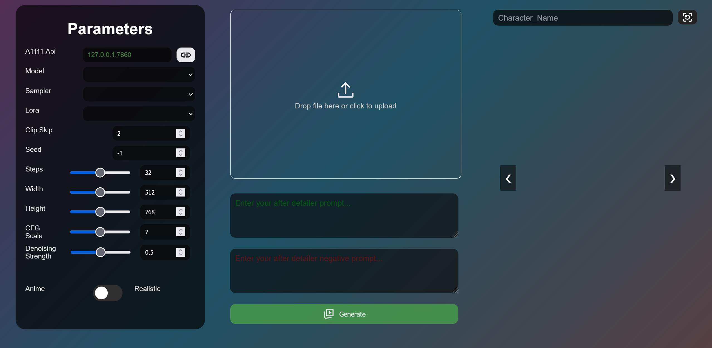

## 2024-11-13
- Docker image available here: [AutoExpress on DockerHub](https://hub.docker.com/r/deepratna/autoexpress)
- Added Logo to UI
- Added Scheduler dropdown
- Added info icon to UI
  - Whenever you hover on the image or the info icon, it will show the raw generation data for convienience.
- Added Settings cog to have a modal for infrequently used settings.
- If element does not exist in dropdown (Model, Sampler, Scheduler, Lora), a new dropdown element is created.

**Avery Contributions**
- Boiler plate Theming Support by modifying [main.css](autoexpress/static/stylesheet/main.css)
- Implemented Gradient pause feature for performace increase.
- Expression jsons are now in different flavours instead of only being Anime/Realistic.
- 

## 2024-09-26
- Tested on Ububtu (22.04.3 | jammy)

## 2024-06-23
- Added revamped UI

- Removed my custom logger and added loguru library.

