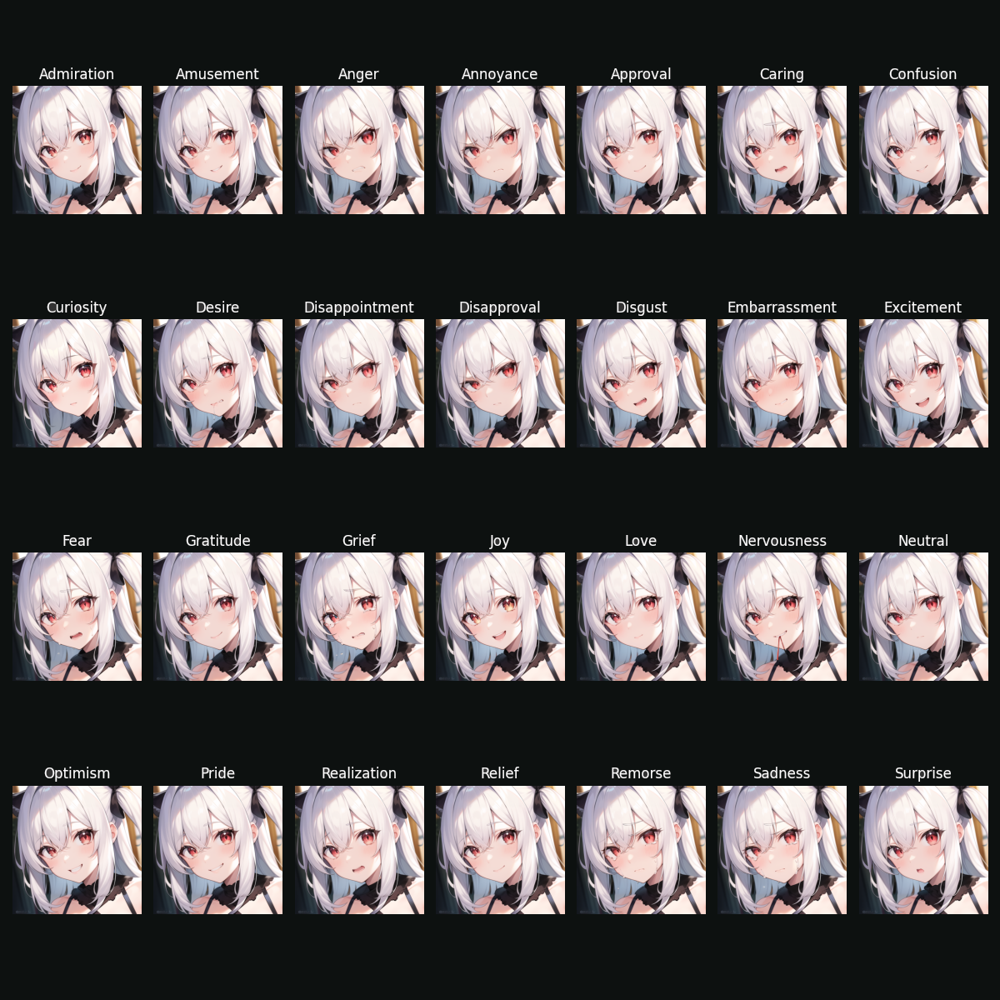
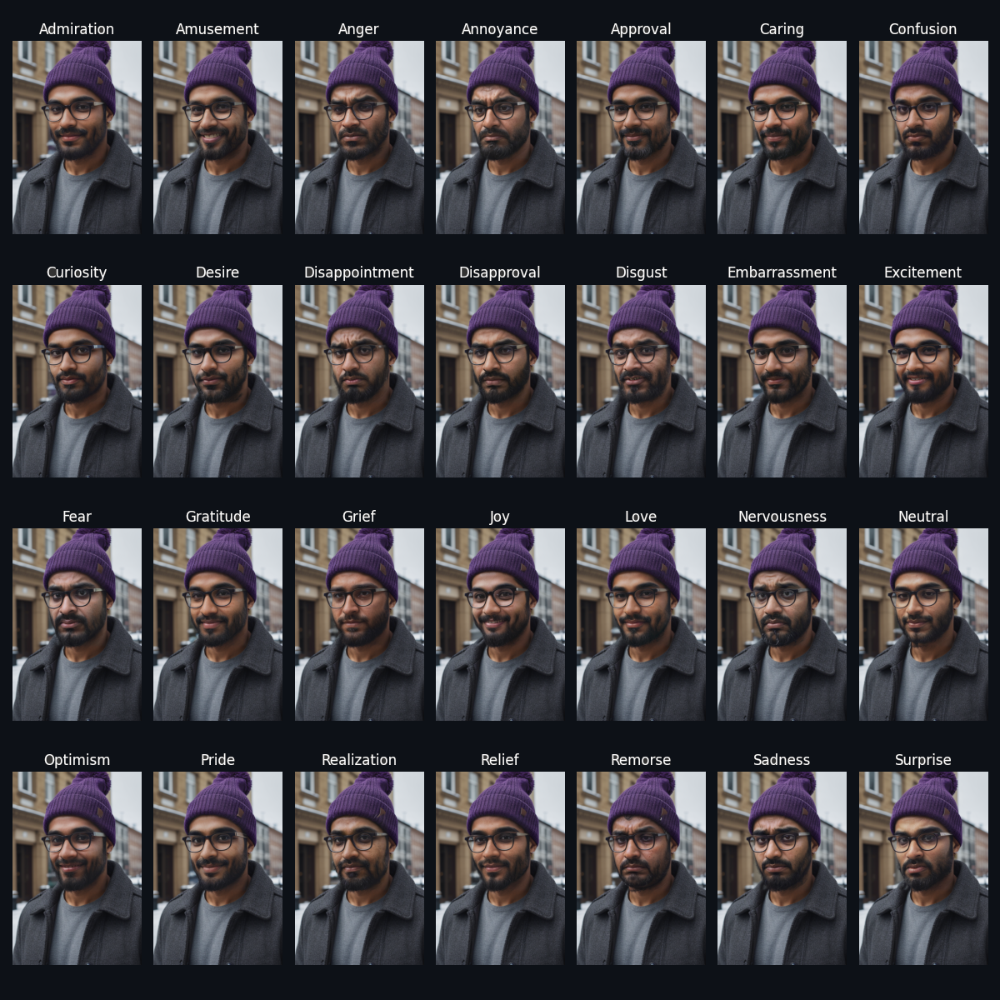
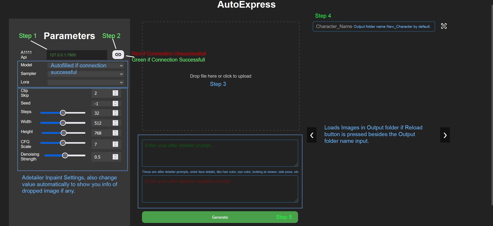
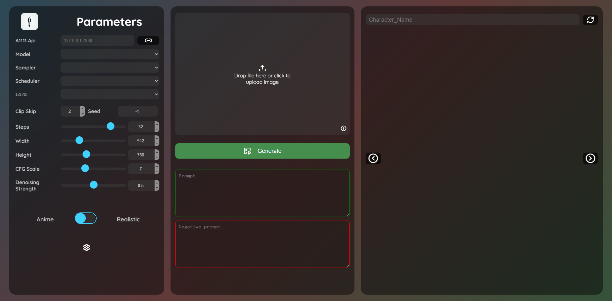

<h1>  AutoExpress</h1>

# Introduction
Automatically creates 28 different expressions from a given image using [Automatic1111 Stable Diffusion WebUI API](https://github.com/AUTOMATIC1111/stable-diffusion-webui). The application uses Inpainting with [After Detailer Extension](https://github.com/Bing-su/adetailer) to inpaint the following expressions on the face:

### For the latest changes, goto: [Change Log](Changelog.md)

<p align="center">

| Emotion       | Emotion        | Emotion     | Emotion     |
| ------------- | -------------- | ----------- | ----------- |
| Admiration    | Amusement      | Anger       | Annoyance   |
| Approval      | Caring         | Confusion   | Curiosity   |
| Desire        | Disappointment | Disapproval | Disgust     |
| Embarrassment | Excitement     | Fear        | Gratitude   |
| Grief         | Joy            | Love        | Nervousness |
| Neutral       | Optimism       | Pride       | Realization |
| Relief        | Remorse        | Sadness     | Surprise    |

</p>


# Examples

### Anime

<div style="text-align:center">
    <figure>
        
        <figcaption>Anime Image Emotion Grid</figcaption>
    </figure>
</div>


The above is an example anime expressions on the following image without cherry picking results.

<div style="text-align:center">
    <figure>
        
        <figcaption>Anime input image</figcaption>
    </figure>
</div>


### Realistic

<div style="text-align:center">
    <figure>
        
        <figcaption>Realistic Image Emotion Grid</figcaption>
    </figure>
</div>

The above is an example realistic expressions on the following image without cherry picking results.

<div style="text-align:center">
    <figure>
        
        <figcaption>Realistic input image</figcaption>
    </figure>
</div>

---

# Requirements
- [Python3](https://www.python.org/downloads/) Prefer version 10
- [Automatic1111 Stable Diffusion WebUI API](https://github.com/AUTOMATIC1111/stable-diffusion-webui)
    - [Online Services](https://github.com/AUTOMATIC1111/stable-diffusion-webui/wiki/Online-Services)
    - I'm currently working on integrating my [CivitAI-Model-Downloader](https://github.com/deepratna-awale/CivitAI-Model-Downloader) to automatically download LORAs.
- [After Detailer Extension](https://github.com/Bing-su/adetailer)

- ## Additional packages for Linux
- python3-pip
- python3-venv


## Run With Docker (Requires [Docker](https://www.docker.com/))

> Now AutoExpress is also available as a [Docker Image](https://hub.docker.com/r/deepratna/autoexpress)

Pull image from DockerHub
```bash
docker pull deepratna/autoexpress
```
Run
```bash
docker run -p 5000:5000 deepratna/autoexpress
```
### OR
Build (skip if you have pulled image)
```bash 
git clone https://github.com/deepratnaawale/AutoExpress.git
cd AutoExpress
```
```bash
docker buildx build --tag ${your_dockerhub_username}/autoexpress .
```
Run
```bash
docker run -p 5000:5000 ${your_dockerhub_username}/autoexpress
```

## Clone Github Repo and cd into it
```bash
git clone https://github.com/deepratnaawale/AutoExpress.git
cd AutoExpress
```

- Create and activate virtual enviorenment
```bash
python3 -m venv .venv
```
- WINDOWS
```bash
.venv\Scripts\activate
```
- LINUX
```bash
source .venv/bin/activate
```

- Install Requirements
```bash
pip install -r requirements.txt
```

- Launch App
```bash
flask --app autoexpress run
```

- Connect to the AutoExpress UI at
[http://127.0.0.1:5000](http:127.0.0.1:5000)

## Launch Your A1111 Stable Diffusion WebUI Api
> You can check if the api is active by accessing the docs (if running locally)
[http://127.0.0.1:7860/docs#/default/](http://127.0.0.1:7860/docs#/default/)


# Usage


It's pretty Straight forward. Keep an eye on the logs in the console. Dropping an image will auto populate all attributes in the UI if the image has Stable Diffusion info text. Only supports A1111 WebUI API for now. 

PS: This is a very handy tool to use with [Silly Tavern](https://github.com/SillyTavern/SillyTavern) to **generate character expressions sprites** for any bot.

# Latest UI


# Future Work
- Change pose along with expression keeping consistent clothes and background. (Probably via Controlnets and ADetailer)
- Better Expressions for Realistic Images.
- Tests to check each module.

# Special Thanks
[SD Parsers by d3x-at](https://github.com/d3x-at/sd-parsers)

[SD API Examples](https://github.com/AUTOMATIC1111/stable-diffusion-webui/discussions/3734)

[Avery Velfaire](https://github.com/AveryVeilfaire) for bug fixes, UI design, and prompt engineering.
